# GreetingWorkflow — Detailed Interaction Diagrams

This document explains, in depth, everything that happens when this repository's
example runs: how the **Starter**, the **Worker**, and the **Temporal Cluster**
talk to each other over gRPC, what the Temporal Server persists at every step,
and how the Go SDK executes deterministic workflow code under the hood.

## 0. Scope & assumptions

These diagrams describe one concrete, reproducible run of this exact codebase:

- One Temporal Server, started via `docker-compose.yml` as `temporal server start-dev --ip 0.0.0.0 --db-filename /home/temporal/temporal.db`, exposing gRPC on `7233` and the Web UI on `8233` (Web UI port = gRPC port + 1000, the dev-server default).
- Because `--db-filename` is set, workflow state is persisted to a SQLite file on the `temporal-data` volume instead of the dev server's normal in-memory mode — history survives `docker compose restart`, but not volume deletion.
- The `default` Namespace (auto-created by `start-dev`), since neither `worker/main.go` nor `starter/main.go` overrides `client.Options.Namespace`.
- One Worker process (`worker/main.go`) polling Task Queue `greeting-task-queue` (`greeting.TaskQueue`), with default `worker.Options{}` — meaning 2 concurrent Workflow Task poller goroutines and 2 concurrent Activity Task poller goroutines (Go SDK default `defaultConcurrentPollRoutineSize = 2`), and Sticky Execution enabled (the SDK's default caching optimization).
- One Starter invocation (`starter/main.go`) starting Workflow ID `greeting-workflow` with input `"Temporal"`, then blocking on the result.
- A single activity call that succeeds on the first attempt — no retries, timeouts, signals, or queries are exercised by the happy path. Failure/replay paths are covered separately in the [Appendix](#9-appendix-paths-not-exercised-by-this-run) for completeness.

### Notation used below

| Symbol | Meaning |
|---|---|
| `->>` | Synchronous request (gRPC call) |
| `-->>` | Response / return |
| `Note` | Internal detail, commentary, or non-network step |
| Colored `rect` band | Groups messages into one logical phase |
| `par ... and ... end` | Two branches that genuinely happen concurrently, not sequentially |

---

## 1. Components inventory

| Component | What it is | Defined in |
|---|---|---|
| **Starter process** | Short-lived CLI that starts one workflow and waits for its result | `starter/main.go` |
| **Worker process** | Long-lived process that polls Temporal and executes workflow/activity code | `worker/main.go` |
| **`GreetingWorkflow`** | The workflow definition (orchestration logic) | `greeting/workflows.go` |
| **`ComposeGreeting`** | The activity definition (does the actual "work") | `greeting/activities.go` |
| **`TaskQueue` constant** | `"greeting-task-queue"` — shared contract between Worker and Starter | `greeting/workflows.go` |
| **Temporal Go SDK client** | gRPC client wrapper (`client.Dial`) used by both processes | `go.temporal.io/sdk/client` |
| **Temporal Go SDK worker runtime** | Pollers, deterministic dispatcher, sticky cache, activity pool | `go.temporal.io/sdk/worker` (inside the Worker process) |
| **Frontend Service** | Single gRPC entry point (`WorkflowService` API) for the whole cluster | Inside the `temporal` container |
| **History Service** | Owns per-execution mutable state & the append-only Event History | Inside the `temporal` container |
| **Matching Service** | Buffers tasks per Task Queue and matches them to long-polling workers | Inside the `temporal` container |
| **Persistence store** | SQLite file `temporal.db` on the `temporal-data` volume | Inside the `temporal` container |
| **Web UI** | Read-only observability UI over the Frontend API | Inside the `temporal` container, port `8233` |

> In production, Frontend/History/Matching (and visibility, e.g. Elasticsearch) are usually independently-scaled services/containers. `temporal server start-dev` runs all of them **in a single process** for local development — `docker-compose.yml` in this repo defines only **one** container/service (`temporal`), not four.

---

## 2. Deployment diagram


Mermaid source

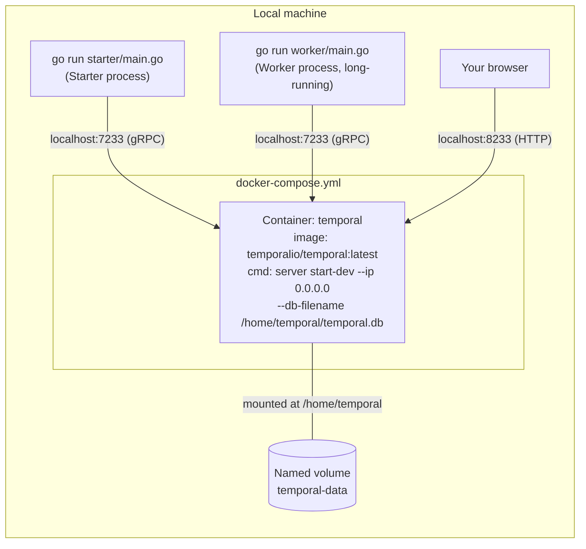

---

## 3. Component / architecture diagram


Mermaid source

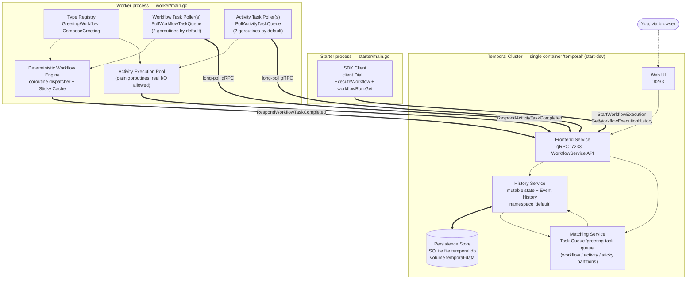

---

## 4. Task Queue anatomy

A single string constant, `greeting-task-queue`, actually names **three independent
queues** inside the Matching Service. This is easy to miss when reading the code,
since both pollers in `worker/main.go` are constructed from the same `worker.New(c,
greeting.TaskQueue, worker.Options{})` call.


Mermaid source

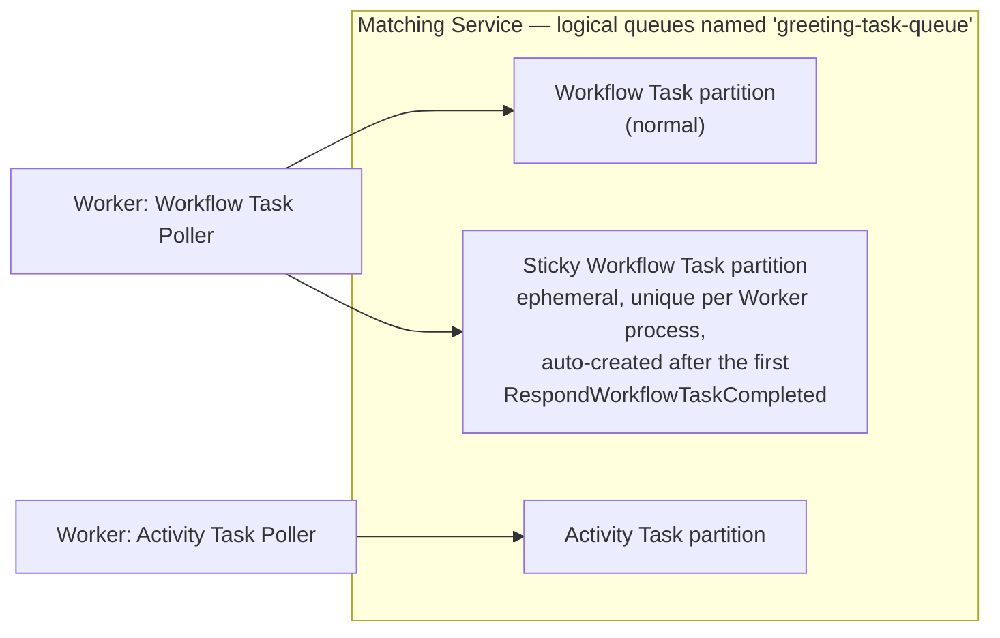

- The **normal** workflow partition is used only for a brand-new run's very first Workflow Task (nothing is cached yet).
- The **sticky** partition is a private queue keyed by this Worker's identity, created the moment the Worker first responds to a Workflow Task for a given Run. Temporal prefers routing follow-up Workflow Tasks for that Run back to the same Worker here, because that Worker already has the coroutine state cached in memory — avoiding a full history replay.
- The **activity** partition is completely independent and can be served by any Worker polling the same Task Queue name.

---

## 5. End-to-end sequence diagram (full lifecycle)

This is the complete, chronological interaction for one run: `starter` starts
`GreetingWorkflow("Temporal")`, the workflow schedules the `ComposeGreeting`
activity, the activity runs, and the workflow completes with `"Hello, Temporal!"`.

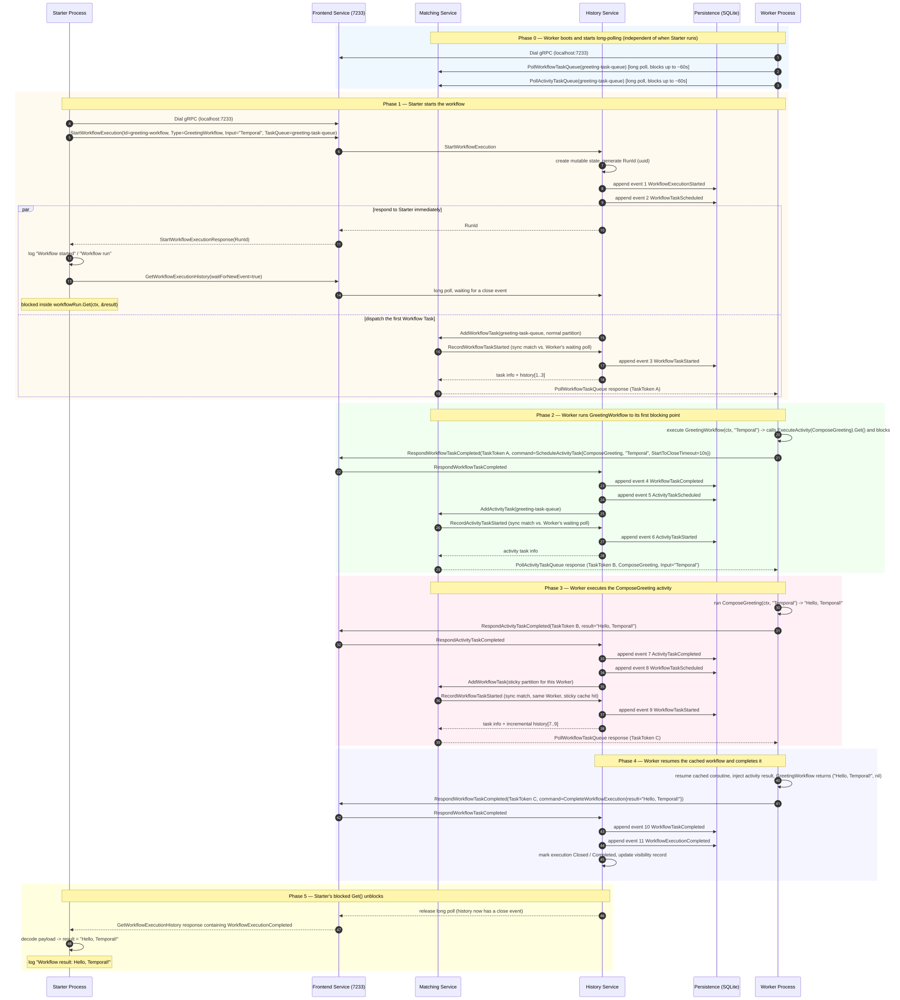

Mermaid source

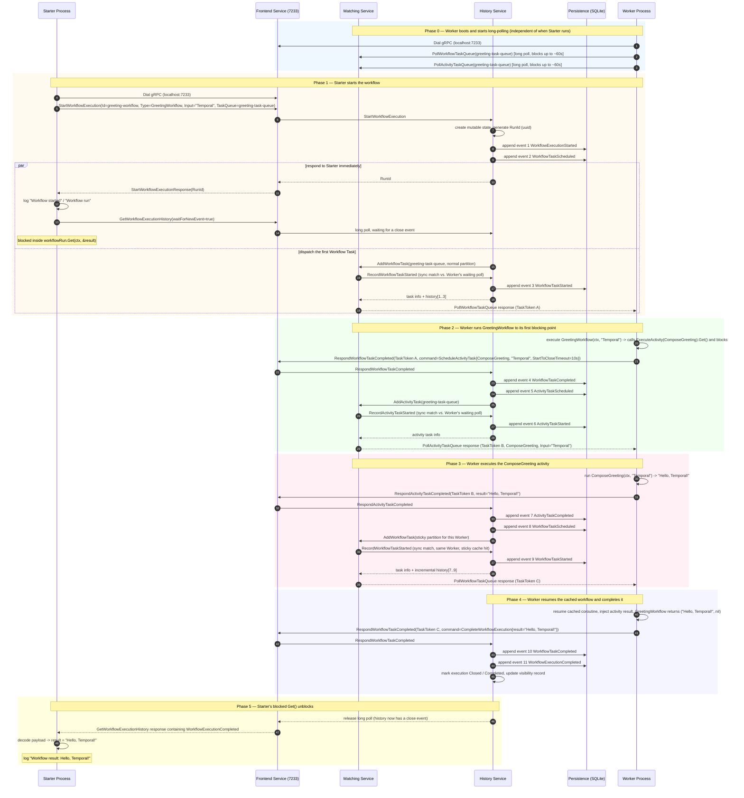

**Why does the workflow need *two* Workflow Tasks?** `workflow.ExecuteActivity(...)`
is asynchronous — it returns a `Future` immediately. The first Workflow Task can
only run `GreetingWorkflow` as far as the `.Get(ctx, &result)` call, at which
point the coroutine yields (blocks) because the activity hasn't run yet. Temporal
must persist that "waiting" state, run the activity elsewhere, and only then
deliver a *second* Workflow Task that resumes the coroutine with the activity's
result and lets it reach `return result, nil`. Every side-effect-producing call
in a workflow follows this schedule → suspend → resume pattern.

---

## 6. Inside the Worker: SDK execution mechanics

The end-to-end diagram treats "Worker" as mostly a black box for its two
`Worker->>Worker` steps. This diagram opens that box up: it shows the SDK-internal
handoff between pollers, the deterministic dispatcher, the sticky cache, and the
plain-goroutine activity pool.

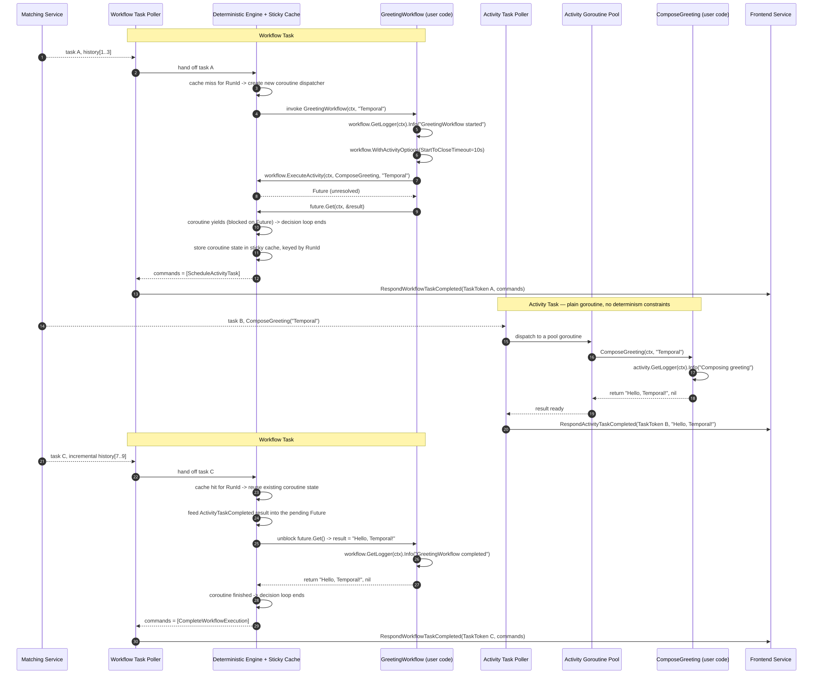

Mermaid source

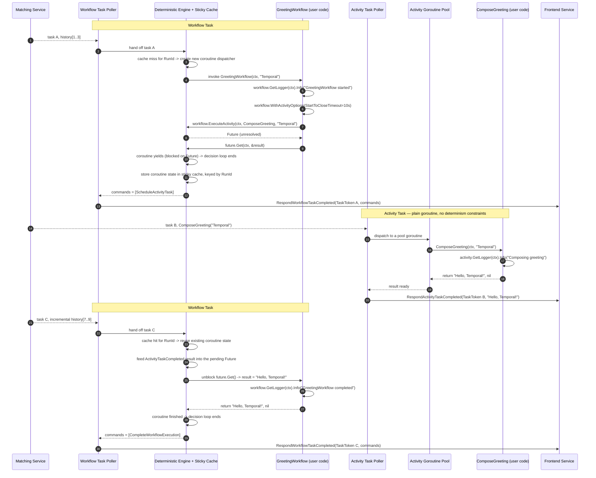

Key SDK rules this diagram illustrates:

- **Workflow code runs in a deterministic coroutine dispatcher.** It must produce identical commands, in identical order, every time it is (re-)executed against the same history — this is what makes replay safe.
- **Activity code runs in an ordinary goroutine.** `ComposeGreeting` is free to do real I/O, call `time.Now()`, generate random numbers, etc. None of that is allowed inside `GreetingWorkflow` itself.
- **The sticky cache is a performance optimization, not a correctness requirement.** A cache hit skips replay entirely; a cache miss (shown in the [Appendix](#9-appendix-paths-not-exercised-by-this-run)) falls back to full replay from event 1.

---

## 7. Resulting Event History

Everything above ultimately produces one linear, append-only **Event History**
for `WorkflowId=greeting-workflow`. This is exactly what you'd see running
`temporal workflow show --workflow-id greeting-workflow` or opening the run in
the Web UI at `http://localhost:8233`.

| # | Event Type | Key attributes | Appended when |
|---|---|---|---|
| 1 | `WorkflowExecutionStarted` | `WorkflowType=GreetingWorkflow`, `Input=["Temporal"]`, `TaskQueue=greeting-task-queue` | Starter calls `ExecuteWorkflow` |
| 2 | `WorkflowTaskScheduled` | `TaskQueue=greeting-task-queue` (normal) | Immediately after event 1 |
| 3 | `WorkflowTaskStarted` | `Identity=<worker host:pid>` | Matching dispatches task A to the Worker |
| 4 | `WorkflowTaskCompleted` | `ScheduledEventId=2`, `StartedEventId=3` | Worker calls `RespondWorkflowTaskCompleted` |
| 5 | `ActivityTaskScheduled` | `ActivityType=ComposeGreeting`, `Input=["Temporal"]`, `StartToCloseTimeout=10s` | Result of processing the `ScheduleActivityTask` command |
| 6 | `ActivityTaskStarted` | `Identity=<worker host:pid>`, `Attempt=1` | Matching dispatches task B to the Worker |
| 7 | `ActivityTaskCompleted` | `Result=["Hello, Temporal!"]` | Worker calls `RespondActivityTaskCompleted` |
| 8 | `WorkflowTaskScheduled` | `TaskQueue=<sticky queue>` | Immediately after event 7 (a Future can now resolve) |
| 9 | `WorkflowTaskStarted` | `Identity=<same worker>` | Matching dispatches task C via the sticky partition |
| 10 | `WorkflowTaskCompleted` | `ScheduledEventId=8`, `StartedEventId=9` | Worker calls `RespondWorkflowTaskCompleted` |
| 11 | `WorkflowExecutionCompleted` | `Result=["Hello, Temporal!"]` | Result of processing the `CompleteWorkflowExecution` command |

All inputs/outputs (`"Temporal"`, `"Hello, Temporal!"`) are serialized to
Payload messages by the default `DataConverter` (JSON encoding) before crossing
the gRPC boundary and before being written to `temporal.db`.

---

## 8. Workflow execution state diagram


Mermaid source

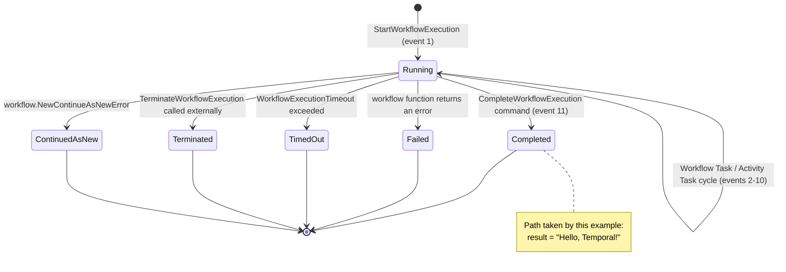

---

## 9. Appendix: paths not exercised by this run

These are shown for completeness ("as applicable") because they involve the
same components and are one config change or one bad day away from happening —
but none of them occur in the actual `GreetingWorkflow("Temporal")` run traced
above.

### 9.1 Activity retry (if `ComposeGreeting` returned an error)

`greeting/workflows.go` sets only `StartToCloseTimeout`; no explicit
`RetryPolicy` is configured, so Temporal applies its **default** retry policy:
1s initial interval, 2.0 backoff coefficient, 100s maximum interval, unlimited
attempts (bounded only by the timeout).

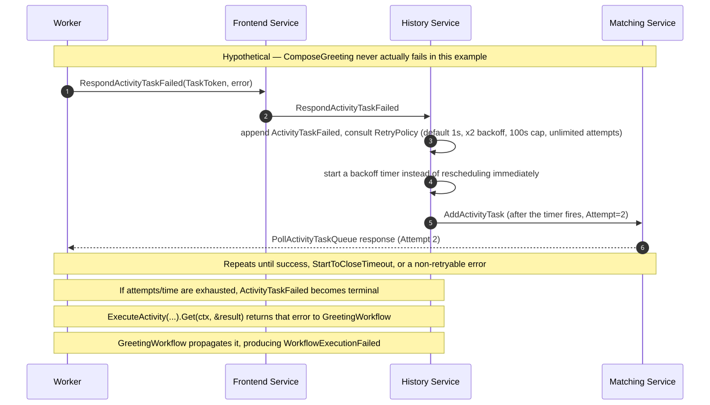

Mermaid source

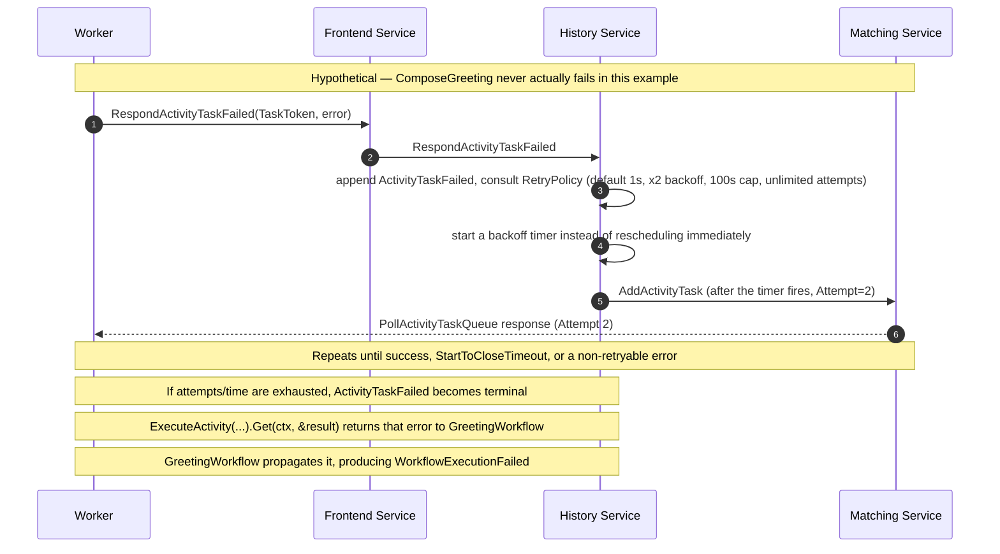

### 9.2 Cold-cache replay (if the Worker restarted or the sticky cache was evicted)

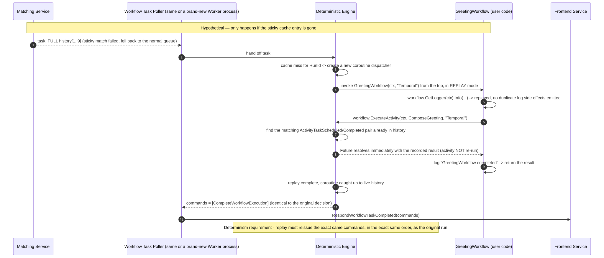

Mermaid source

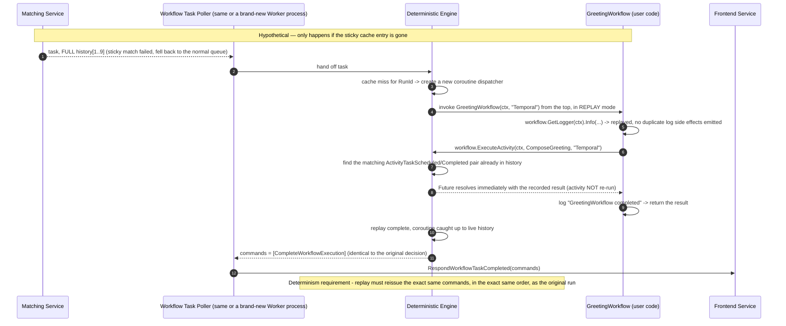

---

## 10. How to observe this yourself

1. `docker compose up -d` — starts the Temporal Cluster (Frontend + History + Matching + Persistence, all in one container).
2. `go run ./worker` — starts the Worker; watch it log `Worker started running on "greeting-task-queue"...`.
3. `go run ./starter` — starts the workflow and blocks until it prints `Workflow result: Hello, Temporal!`.
4. Open `http://localhost:8233`, find `greeting-workflow`, and inspect its **Event History** tab — it will match the table in [section 7](#7-resulting-event-history) exactly (11 events).
5. Optional: with the `temporal` CLI installed, run `temporal workflow show --workflow-id greeting-workflow` for the same history as text.
